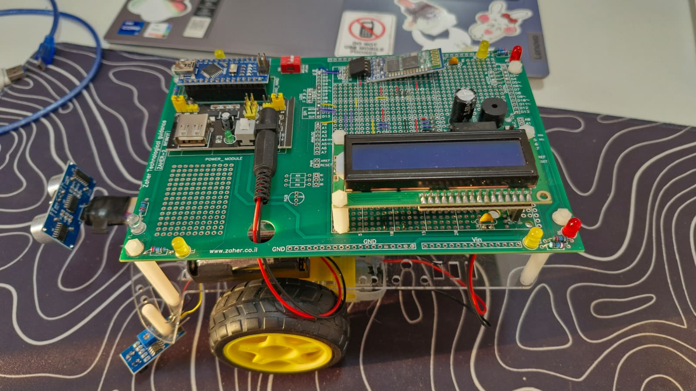

# Edge-Avoiding Bluetooth Controlled Robot

This repository contains the code for an Arduino-based robotic car, developed as a high school project in Electronics and Computer Engineering. The robot is designed to navigate a raised surface, like a table, and autonomously detect and avoid edges to prevent itself from falling. It is controlled remotely via Bluetooth using simple commands sent from a smartphone.

---

## 🚀 Features

* [cite_start]**Autonomous Edge Detection**: Uses two IR sensors to detect the edge of a surface and prevent the robot from falling off[cite: 90].
* [cite_start]**Bluetooth Remote Control**: Can be fully controlled wirelessly using a smartphone or any Bluetooth-enabled device via an HC-06 module[cite: 94].
* [cite_start]**Real-time Status Display**: An I2C LCD screen provides instant feedback on the robot's current status (e.g., "Moving Forward", "Falling Right!")[cite: 89].
* [cite_start]**Visual and Auditory Alerts**: An onboard buzzer and multiple LEDs provide immediate warnings when a fall risk is detected[cite: 92].
* [cite_start]**Directional LED Indicators**: LEDs light up to indicate the robot's direction of movement (forward, backward, left, right)[cite: 325].
* [cite_start]**Obstacle Detection**: A front-facing ultrasonic sensor measures the distance to objects, which is used to provide data when an edge is detected[cite: 91, 526].

---

## ⚙️ How It Works

The robot's operation is managed by an Arduino Nano microcontroller.

1.  **Control**: The user connects their smartphone to the robot's HC-06 Bluetooth module. [cite_start]Using a Bluetooth terminal app, the user can send text commands to control its movement[cite: 421, 422].
2.  [cite_start]**Movement**: The Arduino receives these commands and interprets them to drive the motors via an L293D motor driver, moving the robot forward, backward, left, or right[cite: 359].
3.  **Edge Detection**: While moving, two downward-facing IR sensors continuously scan the surface below. [cite_start]A `HIGH` signal from an IR sensor indicates that it no longer detects a surface beneath it[cite: 468, 660, 661].
4.  **Emergency Stop & Alert**: If an edge is detected, the Arduino immediately triggers an emergency protocol:
    * [cite_start]It halts all motor movement[cite: 665].
    * [cite_start]It activates a buzzer and warning LEDs[cite: 668].
    * [cite_start]It displays a "Falling!" message on the LCD screen, indicating the direction of the fall [cite: 671-679].
5.  [cite_start]**Escape Maneuver**: The robot then autonomously executes an escape maneuver by moving backward and turning away from the detected edge to return to a safe position[cite: 687, 692, 694].
6.  **Ready for Next Command**: Once the maneuver is complete, the robot stops and awaits the next command from the user.

---

## 🛠️ Hardware Components

| Component              | Description                                        |
| ---------------------- | -------------------------------------------------- |
| **Microcontroller** | [cite_start]Arduino Nano [cite: 126]                           |
| **Motor Driver** | [cite_start]L293D Motor Driver [cite: 354]                     |
| **Motors** | 2x DC Motors with Wheels                           |
| **Communication** | [cite_start]HC-06 Bluetooth Module [cite: 417]                 |
| **Display** | [cite_start]16x2 I2C LCD Display [cite: 246]                   |
| **Edge Sensors** | [cite_start]2x IR (Infrared) Sensors [cite: 462]               |
| **Distance Sensor** | [cite_start]1x HC-SR04 Ultrasonic Sensor [cite: 521]           |
| **Alerts** | [cite_start]Buzzer & 8 LEDs [cite: 292, 319]                   |
| **Power** | [cite_start]Custom Power Supply Circuit [cite: 220]            |

---

## 🕹️ Usage

1.  **Power On**: Turn on the robot.
2.  **Bluetooth Pairing**: On your smartphone, search for Bluetooth devices and pair with the **HC-06** module.
3.  **Connect**: Open a Bluetooth serial terminal application (e.g., "Serial Bluetooth Terminal" on Android). Connect to the HC-06 device.
4.  **Send Commands**: Send the following string commands to control the robot:
    * `forward` - Move forward
    * `back` - Move backward
    * `left` - Turn left
    * `right` - Turn right
    * `stop` - Stop all movement

---

## 💻 About the Code

The main logic resides in the `.ino` file.

### Key Functions:

* `loop()`: The main function that runs repeatedly. It checks for user input via `GetInput()` and for fall risks via `CheckForFall()`.
* `CheckForFall()`: Reads the digital state of the two IR sensors to determine if the robot is at an edge.
* `DealWithFall()`: This function is triggered when a fall is detected. It stops the robot, activates the alerts, and calls the appropriate escape maneuver functions.
* `Move()`: Takes the user's command as input and calls the corresponding function to move the robot (e.g., `SkibidiForward()`, `SkibidiRight()`).
* `PrintToLCD()`: A helper function to display messages on the 16x2 LCD screen.

### Required Libraries:
* `LiquidCrystal_I2C.h` - For controlling the I2C LCD display.

---

## 👨‍💻 Project Acknowledgments

* [cite_start]**Student**: Rany Matar 
* [cite_start]**Supervisor**: Kamal Dahamshe 
* [cite_start]**School**: Salvatorian Sisters' Catholic School, Nazareth 

This project was submitted as a final graduation project for the Electronics and Computer Engineering track.